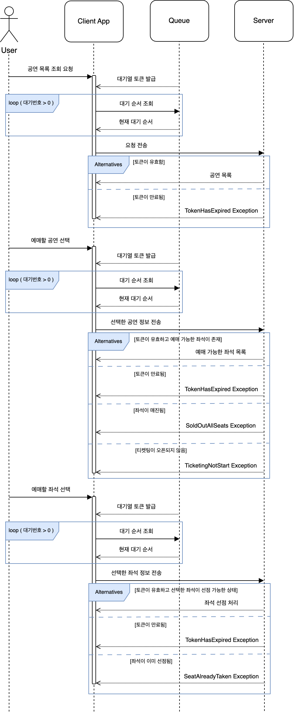

# 🎫 공연 예약 플랫폼

항해플러스 백엔드 4기 시나리오 서버 구축 프로젝트

## 프로젝트 보드

[바로 가기](https://github.com/users/philosophia-dev/projects/1)

- Github Projects 사용
- 프로젝트 Sprint / Milestone 분류 및 이에 따른 일정 관리

## 시나리오 요구사항 분석

### 시나리오 요약

1. `콘서트 예약 서비스` 구현
1. 대기열 시스템 구축 필요
1. 예약 서비스는 작업 가능한 유저만 수행 가능
1. 좌석 예약 시 임시 배정으로 처리하여 다른 유저가 일정 시간 동안 접근할 수 없도록 설정, 배정 시간 내 결제 미완료 시 임시 배정 해제
1. 좌석 결제 완료 시 좌석 소유권 유저에게 정식 배정 및 대기열 토큰 만료 처리
1. 각 기능 및 제약사항에 대한 단위 테스트 작성
1. 다수 인스턴스 환경에서도 문제 없는 기능성 유지
1. 동시성 이슈 고려

### 구현 방식

ver 1

- ~~현단계에서는 우선 Redis를 의도적으로 배제하고 RDBMS만으로 구현~~<br/>대기열 서버와 도메인 서버, 대기열 DB와 도메인 DB를 분리하는 게 더 타당하며, 대기열 DB는 I/O가 잦기 때문에 이 부분에서 퍼포먼스를 발휘할 수 있는 Redis를 도입<br/>차후 Message Broker 도입 예정
- 대기 순서가 올 때까지 client에서 polling을 통해 지속적으로 endpoint에 요청을 보내는 것으로 가정하고, 대기중인 유저에 대해 response로 대기열 데이터 전송 (현재 대기 순서, 대기열 고유 토큰)
- 같은 유저는 동시에 한 번만 대기열에 등록될 수 있음 (다른 endpoint로 중복 요청 불가)
- 예매 진행 시 공연 목록 조회 → 좌석 목록 조회 → 좌석 선점 요청 순으로 진행하는 것을 정상 요청으로 간주하며, 이를 검증하기 위해 첫단계 이후의 요청부터는 전단계의 대기열 토큰을 확인함
- 토큰 유효성 검증 및 만료 조건
  - 각 토큰은 활성화(대기 순서 도래) 후 5분간만 유효함
  - 토큰 발급 시 발급 시간을 저장하고, 활성화 후 활성화 시간 및 만료 시간 저장
  - 예매 진행 시 다음 단계 요청에서 기존에 발급 받은 대기열 토큰을 확인하고 만료, 최종 단계일 시에는 해당 단계에서 만료
  - 페이지, 브라우저 이탈 등의 경우는 client 측에서 감지하고 명시적으로 대기열 토큰 만료 endpoint로 요청을 보내야 함
  - 토큰 유효성 검증 플로우
    

### 시퀀스 다이어그램

- 공연 예매 서비스 이용 시 유저 플로우에 따른 시퀀스

  

- 포인트 서비스 이용 시 유저 플로우에 따른 시퀀스

  

## ERD


## API 명세


NestJS 서버 실행 후 `/api`로 접속하면 Swagger UI로 API 문서를 확인할 수 있다.

<br/>

#### 유저 토큰 발급

<details>
 <summary><code>POST</code> <code><b>/auth/signIn</b></code></summary>

모든 API 요청 헤더에 반드시 포함되어야 하는 유저 토큰을 발급한다.
(임의로 유저 토큰을 발급하기 위한 기능이기 때문에 만료 시간, Refresh 등에 관한 규칙은 따로 설정하지 않음.)

##### Parameters

> | name            | in   | type     | data type | description |
> | --------------- | ---- | -------- | --------- | ----------- |
> | body            | body | required | object    |             |
> | » email_address | body | required | string    |             |
> | » password      | body | required | string    |             |

##### Responses

> Status Code **200**
>
> ```json
> {
>   "accessToken": "{USER_ACCESS_TOKEN}"
> }
> ```
>
> Status Code **400**
>
> ```json
> {
>   "message": "<error-message>",
>   "error": "Bad Request",
>   "statusCode": 400
> }
> ```

</details>

---

#### 대기열 토큰 발급

<details>
 <summary><code>POST</code> <code><b>/queue/queue</b></code></summary>

대기가 필요한 API를 사용하는 데 필요한 대기열 토큰을 발급한다.

##### Headers

> | name          | required | description                                                         |
> | ------------- | -------- | ------------------------------------------------------------------- |
> | Authorization | true     | 유저가 로그인 시 발급 받은 접근 토큰<br/>Bearer {USER_ACCESS_TOKEN} |

##### Parameters

> | name               | in   | type     | data type | description     |
> | ------------------ | ---- | -------- | --------- | --------------- |
> | body               | body | required | object    |                 |
> | » request_endpoint | body | required | string    | 요청할 endpoint |

##### Responses

> Status Code **201**
>
> ```json
> {
>   "id": "{USER_QUEUE_TOKEN}",
>   "requested_endpoint": "/endpoint",
>   "issued_timestamp": 1570543163783,
>   "active_timestamp": 1570543213783,
>   "expire_timestamp": 1570543263783,
>   "rank": 0
> }
> ```
>
> Status Code **400**
>
> ```json
> {
>   "message": "<error-message>",
>   "error": "Bad Request",
>   "statusCode": 400
> }
> ```

</details>

---

#### 대기열 토큰 조회

<details>
 <summary><code>GET</code> <code><b>/queue/queue</b></code></summary>

기존에 발급 받은 대기열 토큰의 정보를 조회한다.

##### Headers

> | name          | required | description                                                         |
> | ------------- | -------- | ------------------------------------------------------------------- |
> | Authorization | true     | 유저가 로그인 시 발급 받은 접근 토큰<br/>Bearer {USER_ACCESS_TOKEN} |
> | Queue-Token   | true     | 유저가 대기열에 등록하고 받은 토큰<br/>Bearer {USER_QUEUE_TOKEN}    |

##### Parameters

None

##### Responses

> Status Code **200**
>
> ```json
> {
>   "id": "{USER_QUEUE_TOKEN}",
>   "requested_endpoint": "/endpoint",
>   "issued_timestamp": 1570543163783,
>   "active_timestamp": 1570543213783,
>   "expire_timestamp": 1570543263783,
>   "rank": 0
> }
> ```
>
> Status Code **400**
>
> ```json
> {
>   "message": "<error-message>",
>   "error": "Bad Request",
>   "statusCode": 400
> }
> ```

</details>

---

#### 대기열 토큰 삭제

<details>
 <summary><code>DELETE</code> <code><b>/queue/queue</b></code></summary>

기존에 발급 받은 대기열 토큰을 삭제한다. 주로 유저의 브라우저 이탈 등의 이벤트 발생 시 client에서 요청하기 위해 사용된다.

##### Headers

> | name          | required | description                                                         |
> | ------------- | -------- | ------------------------------------------------------------------- |
> | Authorization | true     | 유저가 로그인 시 발급 받은 접근 토큰<br/>Bearer {USER_ACCESS_TOKEN} |
> | Queue-Token   | true     | 유저가 대기열에 등록하고 받은 토큰<br/>Bearer {USER_QUEUE_TOKEN}    |

##### Parameters

None

##### Responses

> Status Code **200**
>
> ```json
> {
>   "result": "success"
> }
> ```
>
> Status Code **400**
>
> ```json
> {
>   "message": "<error-message>",
>   "error": "Bad Request",
>   "statusCode": 400
> }
> ```

</details>

---

#### 공연 목록 조회

<details>
 <summary><code>GET</code> <code><b>/reservation/performaces</b></code> </summary>

공연 전체 목록 및 해당 공연의 일정을 반환한다. 각 일정에는 예매 가능한 좌석의 수를 포함한다.

##### Headers

> | name          | required | description                                                         |
> | ------------- | -------- | ------------------------------------------------------------------- |
> | Authorization | true     | 유저가 로그인 시 발급 받은 접근 토큰<br/>Bearer {USER_ACCESS_TOKEN} |
> | Queue-Token   | true     | 유저가 대기열에 등록하고 받은 토큰<br/>Bearer {USER_QUEUE_TOKEN}    |

##### Parameters

> None

##### Responses

> Status Code **200**
>
> 공연 목록을 반환한다.
>
> ```json
> {
>   "title": "공연 제목",
>   "ticketing_start_date": "2024-04-15T00:00:00.000Z",
>   "stage": {
>     "name": "공연장 이름",
>     "location": "공연장 위치"
>   },
>   "performance_staging_date": [
>     {
>       "id": "123e4567-e89b-12d3-a456-426614174000",
>       "staging_date": "2024-05-01T00:00:00.000Z",
>       "reserveable_seats_count": 10
>     }
>   ]
> }
> ```
>
> Status Code **202**
>
> 대기열에 존재하지 않는 유저일 경우 새로 대기열에 추가한 후 대기 정보를 반환한다. 이미 대기열에 존재하는 유저일 경우 현재 대기 정보를 반환한다.
>
> ```json
> {
>   "message": "Please wait for your order to arrive.",
>   "queue_data": {
>     "id": "{UUID}",
>     "issued_timestamp": 1570543163783,
>     "rank": 10
>   },
>   "statusCode": 202
> }
> ```
>
> Status Code **400**
>
> ```json
> {
>   "message": "<error-message>",
>   "error": "Bad Request",
>   "statusCode": 400
> }
> ```
>
> Status Code **401**
>
> ```json
> {
>   "message": "<error-message>",
>   "error": "Unauthorized",
>   "statusCode": 401
> }
> ```

</details>

---

#### 좌석 목록 조회

<details>
<summary><code>GET</code> <code><b>/reservation/performance_seats/{performance_staging_date_id}</b></code></summary>

특정 공연 일정의 좌석 목록을 조회한다. 각 좌석의 예매 가능 상태를 포함한다.

##### Headers

> | name          | required | description                                                         |
> | ------------- | -------- | ------------------------------------------------------------------- |
> | Authorization | true     | 유저가 로그인 시 발급 받은 접근 토큰<br/>Bearer {USER_ACCESS_TOKEN} |
> | Queue-Token   | true     | 유저가 대기열에 등록하고 받은 토큰<br/>Bearer {USER_QUEUE_TOKEN}    |

##### Parameters

> | name                        | in   | type     | data type | description              |
> | --------------------------- | ---- | -------- | --------- | ------------------------ |
> | performance_staging_date_id | path | required | string    | 특정 공연 일정의 고유 ID |

##### Responses

> Status Code **200**
>
> 좌석 목록을 반환한다.
>
> - reservation_status
>   - "AVAILABLE" : 예매 가능
>   - "TEMPORARY_RESERVED" : 이미 선점되어 있으며 결제 대기중
>   - "RESERVED" : 예매됨
>
> ```json
> [
>   {
>     "id": "123e4567-e89b-12d3-a456-426614174000",
>     "seat_number": "1",
>     "price": 70000,
>     "reservation_status": "AVAILABLE"
>   }
> ]
> ```
>
> Status Code **202**
>
> 대기열에 존재하지 않는 유저일 경우 새로 대기열에 추가한 후 대기 정보를 반환한다. 이미 대기열에 존재하는 유저일 경우 현재 대기 정보를 반환한다.
>
> ```json
> {
>   "message": "Please wait for your order to arrive.",
>   "queue_data": {
>     "id": "{UUID}",
>     "rank": 10
>   },
>   "statusCode": 202
> }
> ```
>
> Status Code **400**
>
> ```json
> {
>   "message": "<error-message>",
>   "error": "Bad Request",
>   "statusCode": 400
> }
> ```
>
> Status Code **401**
>
> ```json
> {
>   "message": "<error-message>",
>   "error": "Unauthorized",
>   "statusCode": 401
> }
> ```

</details>

---

#### 좌석 선점 요청

<details>
<summary><code>PATCH</code> <code><b>/reservation/take_performance_seat</b></code></summary>

특정 공연 일정의 특정 좌석을 선점 요청한다.

##### Headers

> | name          | required | description                                                         |
> | ------------- | -------- | ------------------------------------------------------------------- |
> | Authorization | true     | 유저가 로그인 시 발급 받은 접근 토큰<br/>Bearer {USER_ACCESS_TOKEN} |
> | Queue-Token   | true     | 유저가 대기열에 등록하고 받은 토큰<br/>Bearer {USER_QUEUE_TOKEN}    |

##### Parameters

> | name                  | in   | type     | data type | description                          |
> | --------------------- | ---- | -------- | --------- | ------------------------------------ |
> | body                  | body | required | object    |                                      |
> | » performance_seat_id | body | required | string    | 특정 공연 일정의 특정 좌석의 고유 ID |

##### Responses

> Status Code **200**
> 선점 요청 결과를 반환한다.
>
> ```json
> {
>   "result": "success",
>   "data": {
>     "seat_number": "1",
>     "price": 70000,
>     "reservation_status": "TEMPORARY_RESERVED"
>   }
> }
> ```
>
> Status Code **202**
>
> 대기열에 존재하지 않는 유저일 경우 새로 대기열에 추가한 후 대기 정보를 반환한다. 이미 대기열에 존재하는 유저일 경우 현재 대기 정보를 반환한다.
>
> ```json
> {
>   "message": "Please wait for your order to arrive.",
>   "queue_data": {
>     "id": "{UUID}",
>     "rank": 10
>   },
>   "statusCode": 202
> }
> ```
>
> Status Code **400**
>
> ```json
> {
>   "message": "<error-message>",
>   "error": "Bad Request",
>   "statusCode": 400
> }
> ```
>
> Status Code **401**
>
> ```json
> {
>   "message": "<error-message>",
>   "error": "Unauthorized",
>   "statusCode": 401
> }
> ```

</details>

---

#### 선점하거나 예매한 좌석 목록 조회

<details>
<summary><code>GET</code> <code><b>/reservation/reserved_performance_seats</b></code></summary>

유저가 선점하거나 예매한 좌석 목록을 조회한다.

##### Headers

> | name          | required | description                                                         |
> | ------------- | -------- | ------------------------------------------------------------------- |
> | Authorization | true     | 유저가 로그인 시 발급 받은 접근 토큰<br/>Bearer {USER_ACCESS_TOKEN} |

##### Parameters

> None

##### Responses

> Status Code **200**
>
> 유저가 선점하거나 예매한 좌석 목록을 반환한다.
>
> ```json
> [
>   {
>     "title": "공연 제목",
>     "ticketing_start_date": "2024-04-15T00:00:00.000Z",
>     "stage": {
>       "name": "공연장 이름",
>       "location": "공연장 위치"
>     },
>     "performance_staging_date": [
>       {
>         "id": "123e4567-e89b-12d3-a456-426614174000",
>         "staging_date": "2024-05-01T00:00:00.000Z",
>         "seat": [
>           {
>             "id": "123e4567-e89b-12d3-a456-426614174000",
>             "seat_number": "1",
>             "price": 70000,
>             "reservation_status": "TEMPORARY_RESERVED"
>           }
>         ]
>       }
>     ]
>   }
> ]
> ```
>
> Status Code **400**
>
> ```json
> {
>   "message": "<error-message>",
>   "error": "Bad Request",
>   "statusCode": 400
> }
> ```
>
> Status Code **401**
>
> ```json
> {
>   "message": "<error-message>",
>   "error": "Unauthorized",
>   "statusCode": 401
> }
> ```

</details>

---

#### 포인트 잔액 조회

<details>
<summary><code>GET</code> <code><b>/payment/cash</b></code></summary>

현재 포인트의 잔액을 조회한다.

##### Headers

> | name          | required | description                                                         |
> | ------------- | -------- | ------------------------------------------------------------------- |
> | Authorization | true     | 유저가 로그인 시 발급 받은 접근 토큰<br/>Bearer {USER_ACCESS_TOKEN} |

##### Parameters

> None

##### Responses

> Status Code **200**
>
> ```json
> {
>   "balance": 100000
> }
> ```
>
> Status Code **400**
>
> ```json
> {
>   "message": "<error-message>",
>   "error": "Bad Request",
>   "statusCode": 400
> }
> ```
>
> Status Code **401**
>
> ```json
> {
>   "message": "<error-message>",
>   "error": "Unauthorized",
>   "statusCode": 401
> }
> ```

</details>

---

#### 포인트 충전

<details>
 <summary><code>POST</code> <code><b>/payment/cash</b></code> </summary>

포인트를 충전한다.

##### Headers

> | name          | required | description                                                         |
> | ------------- | -------- | ------------------------------------------------------------------- |
> | Authorization | true     | 유저가 로그인 시 발급 받은 접근 토큰<br/>Bearer {USER_ACCESS_TOKEN} |

##### Parameters

> | name     | in   | type     | data type | description |
> | -------- | ---- | -------- | --------- | ----------- |
> | body     | body | required | object    |             |
> | » amount | body | required | number    | 충전할 금액 |

##### Responses

> Status Code **201**
> 충전 결과와 함께 충전 후 잔액을 반환한다.
>
> ```json
> {
>   "result": "success",
>   "balance": 120000
> }
> ```
>
> Status Code **400**
>
> ```json
> {
>   "message": "<error-message>",
>   "error": "Bad Request",
>   "statusCode": 400
> }
> ```
>
> Status Code **401**
>
> ```json
> {
>   "message": "<error-message>",
>   "error": "Unauthorized",
>   "statusCode": 401
> }
> ```

</details>

---

#### 포인트 입출금 내역 조회

<details>
<summary><code>GET</code> <code><b>/payment/payment_history</b></code></summary>

포인트의 입출금 내역을 조회한다.

##### Headers

> | name          | required | description                                                         |
> | ------------- | -------- | ------------------------------------------------------------------- |
> | Authorization | true     | 유저가 로그인 시 발급 받은 접근 토큰<br/>Bearer {USER_ACCESS_TOKEN} |

##### Parameters

> None

##### Responses

> Status Code **200**
>
> ```json
> [
>   {
>     "date_created": "2024-04-08T00:00:00.000Z",
>     "amount": 20000,
>     "cause": "CHARGED_BY_USER",
>     "performance_seat_id": null
>   },
>   {
>     "date_created": "2024-04-08T00:00:00.000Z",
>     "amount": -100000,
>     "cause": "PEYMENT_PERFORMANCE_SEAT",
>     "performance_seat_id": "123e4567-e89b-12d3-a456-426614174000"
>   }
> ]
> ```
>
> Status Code **400**
>
> ```json
> {
>   "message": "<error-message>",
>   "error": "Bad Request",
>   "statusCode": 400
> }
> ```
>
> Status Code **401**
>
> ```json
> {
>   "message": "<error-message>",
>   "error": "Unauthorized",
>   "statusCode": 401
> }
> ```

</details>

---

#### 좌석 결제

<details>
 <summary><code>POST</code> <code><b>/payment/payment_performance_seat</b></code> </summary>

선점한 좌석을 결제한다.

##### Headers

> | name          | required | description                                                         |
> | ------------- | -------- | ------------------------------------------------------------------- |
> | Authorization | true     | 유저가 로그인 시 발급 받은 접근 토큰<br/>Bearer {USER_ACCESS_TOKEN} |

##### Parameters

> | name                  | in   | type     | data type | description                          |
> | --------------------- | ---- | -------- | --------- | ------------------------------------ |
> | body                  | body | required | object    |                                      |
> | » performance_seat_id | body | required | string    | 특정 공연 일정의 특정 좌석의 고유 ID |

##### Responses

> Status Code **201**
>
> 결제 결과와 결제한 좌석의 ID를 반환한다.
>
> ```json
> {
>   "result": "success",
>   "performance_seat_id": "123e4567-e89b-12d3-a456-426614174000"
> }
> ```
>
> Status Code **400**
>
> ```json
> {
>   "message": "<error-message>",
>   "error": "Bad Request",
>   "statusCode": 400
> }
> ```
>
> Status Code **401**
>
> ```json
> {
>   "message": "<error-message>",
>   "error": "Unauthorized",
>   "statusCode": 401
> }
> ```

</details>

---

## 기술 스택

- `Backend`
  NestJS, Typescript, TypeORM, Jest, JWT
- `Data`
  PostgreSQL
- `Infra`
  docker, docker-compose
