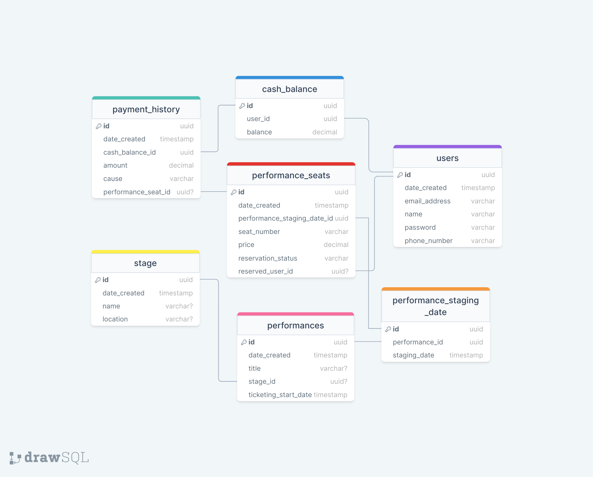

# 🎫 공연 예약 플랫폼

항해플러스 백엔드 4기 시나리오 서버 구축 프로젝트

## 프로젝트 보드

[바로 가기](https://github.com/users/philosophia-dev/projects/1)

- Github Projects 사용
- 프로젝트 Sprint / Milestone 분류 및 이에 따른 일정 관리

## 시나리오 요구사항 분석

### 시퀀스 다이어그램

- 공연 예매 서비스 이용 시 유저 플로우에 따른 시퀀스

  


- 포인트 서비스 이용 시 유저 플로우에 따른 시퀀스

  

## ERD



## API 명세

#### 유저 토큰 발급

<details>
 <summary><code>POST</code> <code><b>/signIn</b></code></summary>

모든 API 요청 헤더에 반드시 포함되어야 하는 유저 토큰을 발급한다.
(임의로 유저 토큰을 발급하기 위한 기능이기 때문에 만료 시간, Refresh 등에 관한 규칙은 따로 설정하지 않음.)

##### Parameters

> | name            | in   | type     | data type | description |
> | --------------- | ---- | -------- | --------- | ----------- |
> | body            | body | required | object    |             |
> | » email_address | body | required | string    |             |
> | » password      | body | required | string    |             |

##### Responses

> Status Code **200**
>
> ```json
> {
>   "accessToken": "{USER_ACCESS_TOKEN}"
> }
> ```
>
> Status Code **400**
>
> ```json
> {
>   "message": "<error-message>",
>   "error": "Bad Request",
>   "statusCode": 400
> }
> ```

</details>

---

#### 공연 목록 조회

<details>
 <summary><code>GET</code> <code><b>/performaces</b></code> </summary>

공연 전체 목록 및 해당 공연의 일정을 반환한다. 각 일정에는 예매 가능한 좌석의 수를 포함한다.

##### Headers

> | name          | required | description                                                         |
> | ------------- | -------- | ------------------------------------------------------------------- |
> | Authorization | true     | 유저가 로그인 시 발급 받은 접근 토큰<br/>Bearer {USER_ACCESS_TOKEN} |

##### Parameters

> None

##### Responses

> Status Code **200**
>
> 공연 목록과 함께 대기열 정보를 함께 반환한다.
>
> ```json
> {
>   "data": {
>     "title": "공연 제목",
>     "ticketing_start_date": "2024-04-15T00:00:00.000Z",
>     "stage": {
>       "name": "공연장 이름",
>       "location": "공연장 위치"
>     },
>     "performance_staging_date": [
>       {
>         "id": 1,
>         "staging_date": "2024-05-01T00:00:00.000Z",
>         "reserveable_seats_count": 10
>       }
>     ]
>   },
>   "queue_data": {
>     "id": "{UUID}",
>     "issued_timestamp": 1570543163783,
>     "active_timestamp": 1570543213783,
>     "expire_timestamp": 1570543263783,
>     "rank": 0
>   }
> }
> ```
>
> Status Code **202**
>
> 대기열에 존재하지 않는 유저일 경우 새로 대기열에 추가한 후 대기 정보를 반환한다. 이미 대기열에 존재하는 유저일 경우 현재 대기 정보를 반환한다.
>
> ```json
> {
>   "message": "Please wait for your order to arrive.",
>   "queue_data": {
>     "id": "{UUID}",
>     "issued_timestamp": 1570543163783,
>     "rank": 10
>   },
>   "statusCode": 202
> }
> ```
>
> Status Code **400**
>
> ```json
> {
>   "message": "<error-message>",
>   "error": "Bad Request",
>   "statusCode": 400
> }
> ```
>
> Status Code **401**
>
> ```json
> {
>   "message": "<error-message>",
>   "error": "Unauthorized",
>   "statusCode": 401
> }
> ```

</details>

---

#### 좌석 목록 조회

<details>
<summary><code>GET</code> <code><b>/performance_seats/{performance_staging_date_id}</b></code></summary>

특정 공연 일정의 좌석 목록을 조회한다. 각 좌석의 예매 가능 상태를 포함한다.

##### Headers

> | name          | required | description                                                         |
> | ------------- | -------- | ------------------------------------------------------------------- |
> | Authorization | true     | 유저가 로그인 시 발급 받은 접근 토큰<br/>Bearer {USER_ACCESS_TOKEN} |

##### Parameters

> | name                        | in   | type     | data type | description              |
> | --------------------------- | ---- | -------- | --------- | ------------------------ |
> | performance_staging_date_id | path | required | integer   | 특정 공연 일정의 고유 ID |

##### Responses

> Status Code **200**
> 좌석 목록과 함께 대기열 정보를 함께 반환한다.
>
> - reservation_status
>   - "AVAILABLE" : 예매 가능
>   - "TEMPORARY_RESERVED" : 이미 선점되어 있으며 결제 대기중
>   - "RESERVED" : 예매됨
>
> ```json
> {
>   "data": [
>     {
>       "id": 1,
>       "seat_number": "1",
>       "price": 70000,
>       "reservation_status": "AVAILABLE"
>     }
>   ],
>   "queue_data": {
>     "id": "{UUID}",
>     "issued_timestamp": 1570543163783,
>     "active_timestamp": 1570543213783,
>     "expire_timestamp": 1570543263783,
>     "rank": 0
>   }
> }
> ```
>
> Status Code **202**
> 대기열에 존재하지 않는 유저일 경우 새로 대기열에 추가한 후 대기 정보를 반환한다. 이미 대기열에 존재하는 유저일 경우 현재 대기 정보를 반환한다.
>
> ```json
> {
>   "message": "Please wait for your order to arrive.",
>   "queue_data": {
>     "id": "{UUID}",
>     "rank": 10
>   },
>   "statusCode": 202
> }
> ```
>
> Status Code **400**
>
> ```json
> {
>   "message": "<error-message>",
>   "error": "Bad Request",
>   "statusCode": 400
> }
> ```
>
> Status Code **401**
>
> ```json
> {
>   "message": "<error-message>",
>   "error": "Unauthorized",
>   "statusCode": 401
> }
> ```

</details>

---

#### 좌석 선점 요청

<details>
<summary><code>PATCH</code> <code><b>/take_performance_seat</b></code></summary>

특정 공연 일정의 특정 좌석을 선점 요청한다.

##### Headers

> | name          | required | description                                                         |
> | ------------- | -------- | ------------------------------------------------------------------- |
> | Authorization | true     | 유저가 로그인 시 발급 받은 접근 토큰<br/>Bearer {USER_ACCESS_TOKEN} |

##### Parameters

> | name                  | in   | type     | data type | description                          |
> | --------------------- | ---- | -------- | --------- | ------------------------------------ |
> | body                  | body | required | object    |                                      |
> | » performance_seat_id | body | required | integer   | 특정 공연 일정의 특정 좌석의 고유 ID |

##### Responses

> Status Code **200**
> 선점 요청 결과와 함께 대기열 정보를 함께 반환한다.
>
> ```json
> {
>   "result": "success",
>   "data": {
>     "seat_number": "1",
>     "price": 70000,
>     "reservation_status": "TEMPORARY_RESERVED"
>   },
>   "queue_data": {
>     "id": "{UUID}",
>     "issued_timestamp": 1570543163783,
>     "active_timestamp": 1570543213783,
>     "expire_timestamp": 1570543263783,
>     "rank": 0
>   }
> }
> ```
>
> Status Code **202**
> 대기열에 존재하지 않는 유저일 경우 새로 대기열에 추가한 후 대기 정보를 반환한다. 이미 대기열에 존재하는 유저일 경우 현재 대기 정보를 반환한다.
>
> ```json
> {
>   "message": "Please wait for your order to arrive.",
>   "queue_data": {
>     "id": "{UUID}",
>     "rank": 10
>   },
>   "statusCode": 202
> }
> ```
>
> Status Code **400**
>
> ```json
> {
>   "message": "<error-message>",
>   "error": "Bad Request",
>   "statusCode": 400
> }
> ```
>
> Status Code **401**
>
> ```json
> {
>   "message": "<error-message>",
>   "error": "Unauthorized",
>   "statusCode": 401
> }
> ```

</details>

---

#### 선점하거나 예매한 좌석 목록 조회

<details>
<summary><code>GET</code> <code><b>/reserved_performance_seats</b></code></summary>

유저가 선점하거나 예매한 좌석 목록을 조회한다.

##### Headers

> | name          | required | description                                                         |
> | ------------- | -------- | ------------------------------------------------------------------- |
> | Authorization | true     | 유저가 로그인 시 발급 받은 접근 토큰<br/>Bearer {USER_ACCESS_TOKEN} |

##### Parameters

> None

##### Responses

> Status Code **200**
> 유저가 선점하거나 예매한 좌석 목록과 함께 대기열 정보를 함께 반환한다.
>
> ```json
> {
>   "data": {
>     "title": "공연 제목",
>     "ticketing_start_date": "2024-04-15T00:00:00.000Z",
>     "stage": {
>       "name": "공연장 이름",
>       "location": "공연장 위치"
>     },
>     "performance_staging_date": [
>       {
>         "id": 1,
>         "staging_date": "2024-05-01T00:00:00.000Z",
>         "seat": {
>           "id": 1,
>           "seat_number": "1",
>           "price": 70000,
>           "reservation_status": "TEMPORARY_RESERVED"
>         }
>       }
>     ]
>   },
>   "data": [
>     {
>       "id": 1,
>       "seat_number": "1",
>       "price": 70000,
>       "reservation_status": "AVAILABLE"
>     }
>   ],
>   "queue_data": {
>     "id": "{UUID}",
>     "issued_timestamp": 1570543163783,
>     "active_timestamp": 1570543213783,
>     "expire_timestamp": 1570543263783,
>     "rank": 0
>   }
> }
> ```
>
> Status Code **202**
> 대기열에 존재하지 않는 유저일 경우 새로 대기열에 추가한 후 대기 정보를 반환한다. 이미 대기열에 존재하는 유저일 경우 현재 대기 정보를 반환한다.
>
> ```json
> {
>   "message": "Please wait for your order to arrive.",
>   "queue_data": {
>     "id": "{UUID}",
>     "rank": 10
>   },
>   "statusCode": 202
> }
> ```
>
> Status Code **400**
>
> ```json
> {
>   "message": "<error-message>",
>   "error": "Bad Request",
>   "statusCode": 400
> }
> ```
>
> Status Code **401**
>
> ```json
> {
>   "message": "<error-message>",
>   "error": "Unauthorized",
>   "statusCode": 401
> }
> ```

</details>

---

#### 포인트 잔액 조회

<details>
<summary><code>GET</code> <code><b>/cash_balance</b></code></summary>

현재 포인트의 잔액을 조회한다.

##### Headers

> | name          | required | description                                                         |
> | ------------- | -------- | ------------------------------------------------------------------- |
> | Authorization | true     | 유저가 로그인 시 발급 받은 접근 토큰<br/>Bearer {USER_ACCESS_TOKEN} |

##### Parameters

> None

##### Responses

> Status Code **200**
>
> ```json
> {
>   "balance": 100000
> }
> ```
>
> Status Code **400**
>
> ```json
> {
>   "message": "<error-message>",
>   "error": "Bad Request",
>   "statusCode": 400
> }
> ```
>
> Status Code **401**
>
> ```json
> {
>   "message": "<error-message>",
>   "error": "Unauthorized",
>   "statusCode": 401
> }
> ```

</details>

---

#### 포인트 충전

<details>
 <summary><code>PATCH</code> <code><b>/cash_charge</b></code> </summary>

포인트를 충전한다.

##### Headers

> | name          | required | description                                                         |
> | ------------- | -------- | ------------------------------------------------------------------- |
> | Authorization | true     | 유저가 로그인 시 발급 받은 접근 토큰<br/>Bearer {USER_ACCESS_TOKEN} |

##### Parameters

> | name     | in   | type     | data type | description |
> | -------- | ---- | -------- | --------- | ----------- |
> | body     | body | required | object    |             |
> | » amount | body | required | integer   | 충전할 금액 |

##### Responses

> Status Code **200**
> 충전 결과와 함께 충전 후 잔액을 반환한다.
>
> ```json
> {
>   "result": "success",
>   "balance": 120000
> }
> ```
>
> Status Code **400**
>
> ```json
> {
>   "message": "<error-message>",
>   "error": "Bad Request",
>   "statusCode": 400
> }
> ```
>
> Status Code **401**
>
> ```json
> {
>   "message": "<error-message>",
>   "error": "Unauthorized",
>   "statusCode": 401
> }
> ```

</details>

---

#### 포인트 입출금 내역 조회

<details>
<summary><code>GET</code> <code><b>/payment_history</b></code></summary>

포인트의 입출금 내역을 조회한다.

##### Headers

> | name          | required | description                                                         |
> | ------------- | -------- | ------------------------------------------------------------------- |
> | Authorization | true     | 유저가 로그인 시 발급 받은 접근 토큰<br/>Bearer {USER_ACCESS_TOKEN} |

##### Parameters

> None

##### Responses

> Status Code **200**
>
> ```json
> [
>   {
>     "date_created": "2024-04-08T00:00:00.000Z",
>     "amount": 20000,
>     "cause": "CHARGED_BY_USER",
>     "performance_seat_id": Null
>   },
>   {
>     "date_created": "2024-04-08T00:00:00.000Z",
>     "amount": -100000,
>     "cause": "PEYMENT_PERFORMANCE_SEAT",
>     "performance_seat_id": 1
>   }
> ]
> ```
>
> Status Code **400**
>
> ```json
> {
>   "message": "<error-message>",
>   "error": "Bad Request",
>   "statusCode": 400
> }
> ```
>
> Status Code **401**
>
> ```json
> {
>   "message": "<error-message>",
>   "error": "Unauthorized",
>   "statusCode": 401
> }
> ```

</details>

---

#### 좌석 결제

<details>
 <summary><code>PATCH</code> <code><b>/payment_performance_seat</b></code> </summary>

선점한 좌석을 결제한다.

##### Headers

> | name          | required | description                                                         |
> | ------------- | -------- | ------------------------------------------------------------------- |
> | Authorization | true     | 유저가 로그인 시 발급 받은 접근 토큰<br/>Bearer {USER_ACCESS_TOKEN} |

##### Parameters

> | name                  | in   | type     | data type | description                          |
> | --------------------- | ---- | -------- | --------- | ------------------------------------ |
> | body                  | body | required | object    |                                      |
> | » performance_seat_id | body | required | integer   | 특정 공연 일정의 특정 좌석의 고유 ID |

##### Responses

> Status Code **200**
> 결제 결과와 결제한 좌석의 ID를 반환한다.
>
> ```json
> {
>   "result": "success",
>   "performance_seat_id": 1
> }
> ```
>
> Status Code **400**
>
> ```json
> {
>   "message": "<error-message>",
>   "error": "Bad Request",
>   "statusCode": 400
> }
> ```
>
> Status Code **401**
>
> ```json
> {
>   "message": "<error-message>",
>   "error": "Unauthorized",
>   "statusCode": 401
> }
> ```

</details>

---
